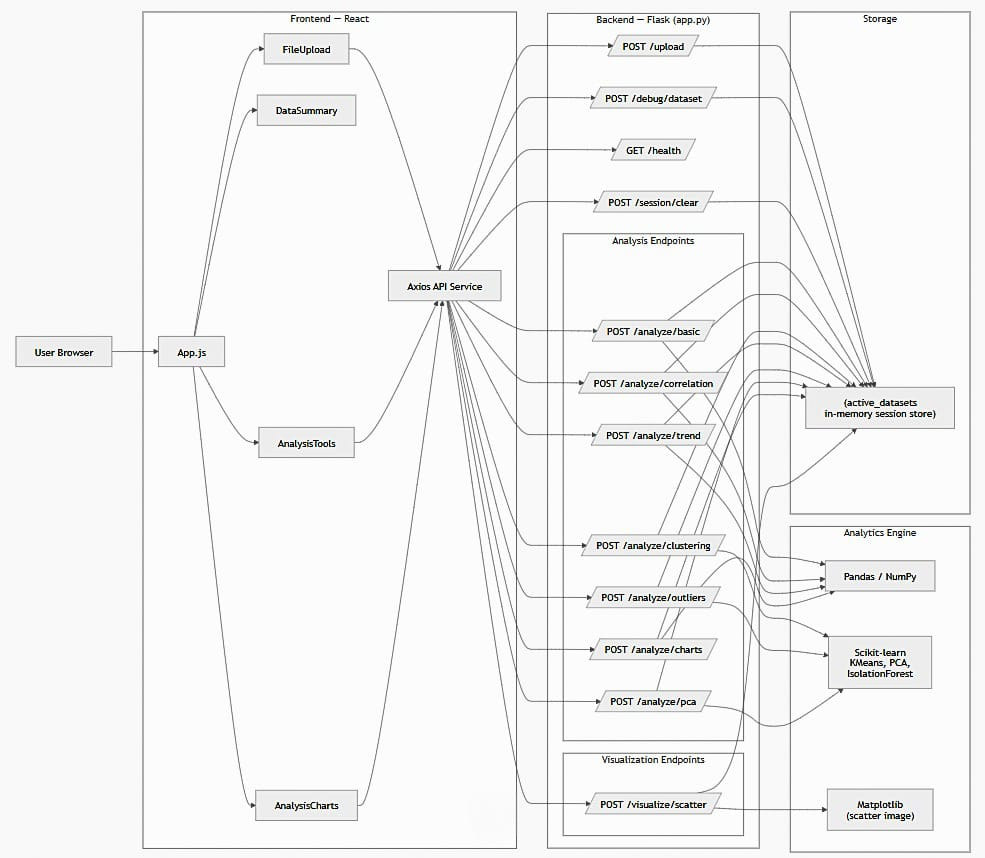
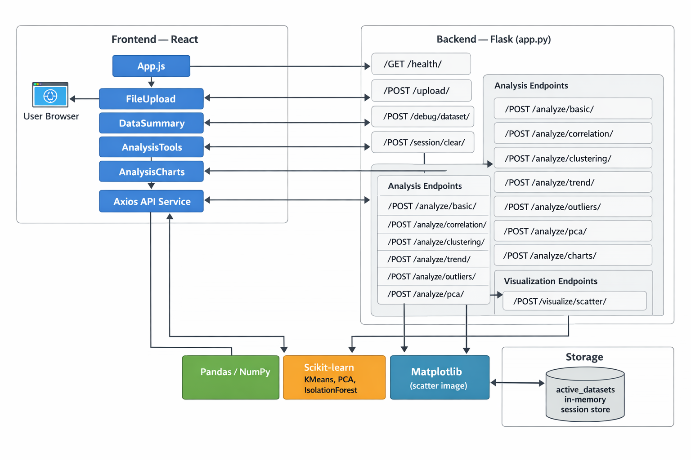
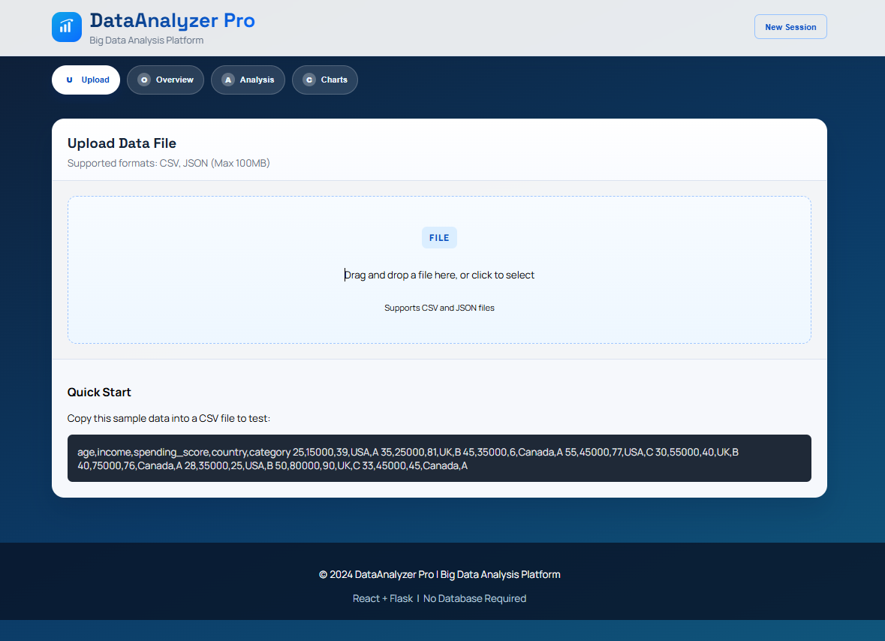
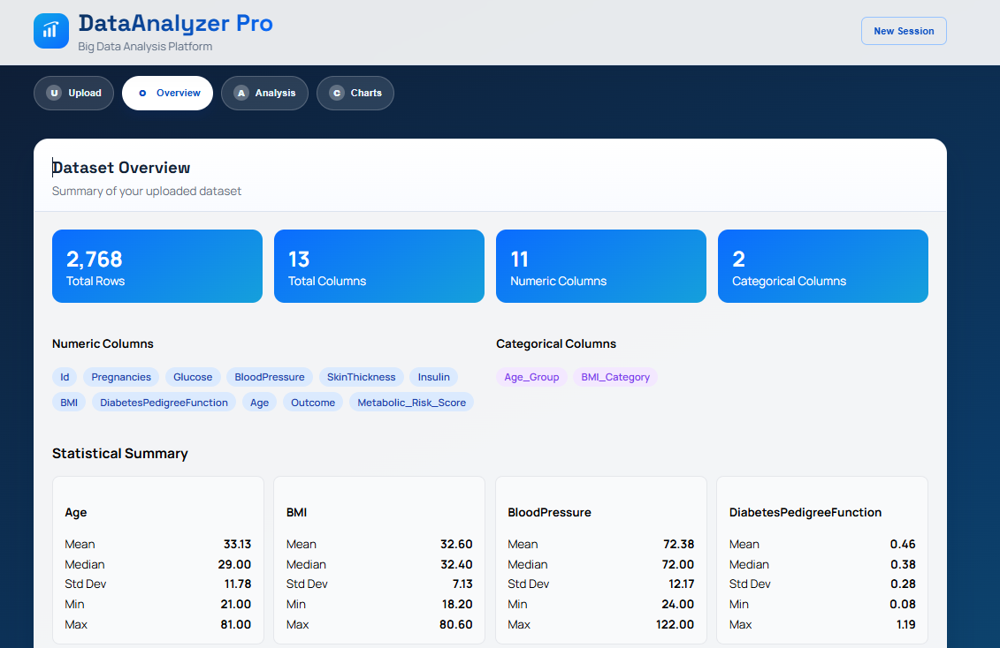
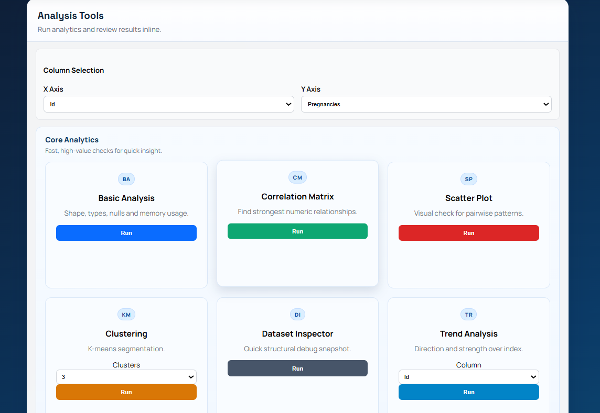
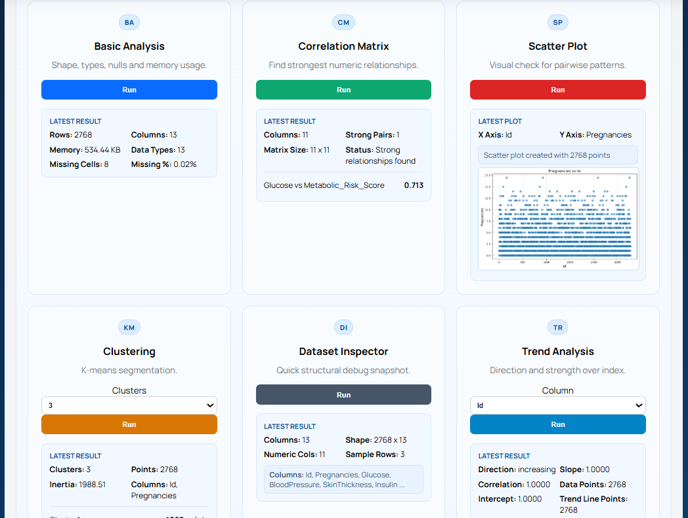
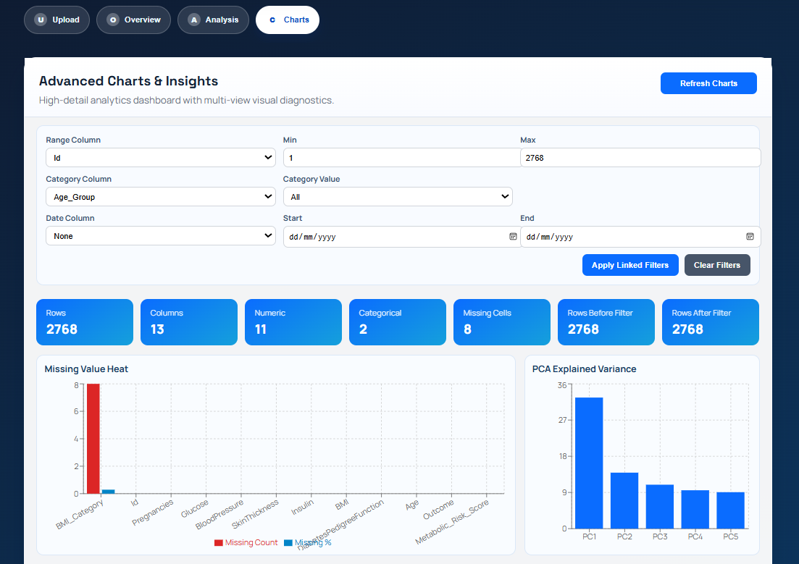
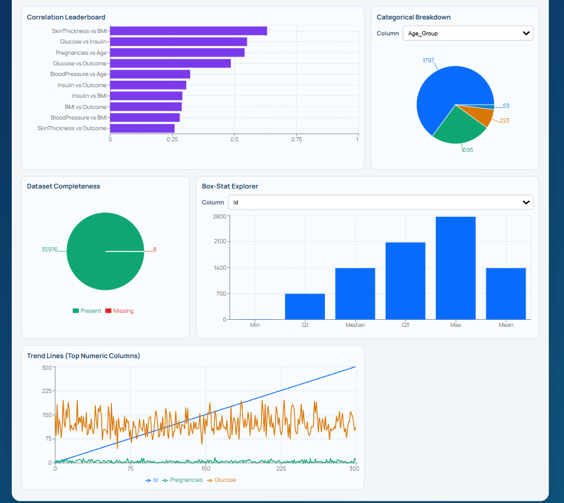

# 📊 DataAnalyzer Pro

<p align="center">
  <strong>Professional Big Data Analysis Platform</strong><br/>
  Upload datasets, run advanced analytics, and explore linked interactive dashboards.
</p>

<p align="center">
  
  
  
  
  
</p>

---


---
## ✨ Key Features

- 📁 **Smart Upload**: CSV/JSON upload with in-memory sessions
- 📌 **Data Summary**: rows, columns, dtypes, missing values, memory profile
- 🧠 **Core Analytics**:
  - Correlation matrix
  - K-means clustering
  - Scatter visualization
  - Trend analysis
  - Outlier detection (Z-score + Isolation Forest)
  - PCA with explained variance and loadings
- 📈 **Advanced Charts Dashboard**:
  - Distribution views
  - Box stats
  - Correlation leaderboard
  - PCA variance visuals
  - Categorical breakdowns
- 🎛️ **Linked Filters**: date + numeric range + category filters update all charts together
- ⚡ **No Database Required**: fast local analytics workflow

---

## 🧰 Tech Stack

- **Frontend**: React, Axios, Recharts, React Dropzone
- **Backend**: Flask, Pandas, NumPy, Scikit-learn, Matplotlib
- **Data/Compute**: In-memory sessions, optional Dask ecosystem libs
---
## 🏗️ System Architecture


---
## 📸 Screenshots







---

## 🗂️ Project Structure

```text
Bigdata-analysis-app/
├─ backend/
│  ├─ app.py
│  └─ requirements_new.txt
├─ frontend/
│  ├─ public/
│  └─ src/
│     ├─ components/
│     │  ├─ FileUpload.js
│     │  ├─ DataSummary.js
│     │  ├─ AnalysisTools.js
│     │  └─ AnalysisCharts.js
│     ├─ services/
│     │  └─ api.js
│     └─ App.js
└─ sample_data/
```

---

## 🚀 Quick Start

### 1. Backend

```bash
cd backend
python -m venv venv
```

Windows:

```bash
venv\Scripts\activate
```

macOS/Linux:

```bash
source venv/bin/activate
```

Install and run:

```bash
pip install -r requirements_new.txt
python app.py
```

Backend URL: `http://localhost:5000`

### 2. Frontend

```bash
cd frontend
npm install
npm start
```

Frontend URL: `http://localhost:3000`

---

## 🔌 Main API Endpoints

- `GET /health`
- `POST /upload`
- `POST /analyze/basic`
- `POST /analyze/correlation`
- `POST /analyze/clustering`
- `POST /visualize/scatter`
- `POST /analyze/trend`
- `POST /analyze/outliers`
- `POST /analyze/pca`
- `POST /analyze/charts`
- `POST /debug/dataset`
- `POST /session/clear`

---

## 🧭 Usage Flow

1. Upload CSV/JSON file
2. Review dataset summary
3. Run analyses in **Analysis** tab
4. Explore insights in **Charts** tab
5. Apply linked filters for full dashboard cross-filtering

---

## 🛠️ Troubleshooting

- **`ERR_CONNECTION_REFUSED`**  
  Start backend first (`python app.py` in `backend/`).

- **`Session not found`**  
  Session expired/cleared. Re-upload dataset.

- **Frontend dependency issues**  
  Reinstall frontend packages:
  ```bash
  cd frontend
  npm install
  ```

---

## 📌 Notes

- Sessions are stored in memory.
- Best for local analysis and prototyping.
- Supports `.csv` and `.json` inputs.
