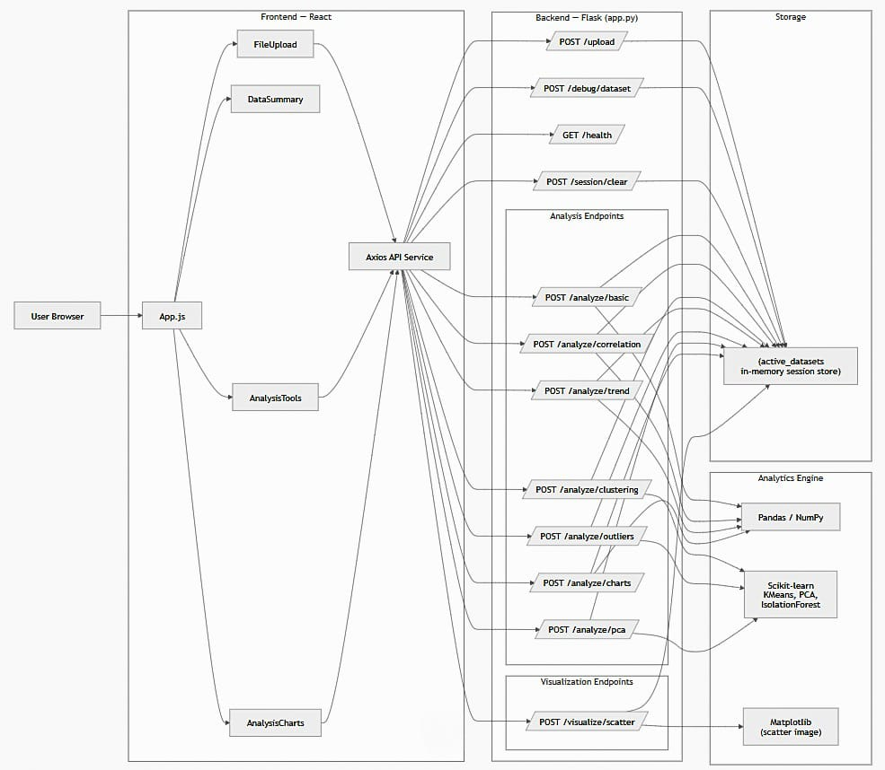
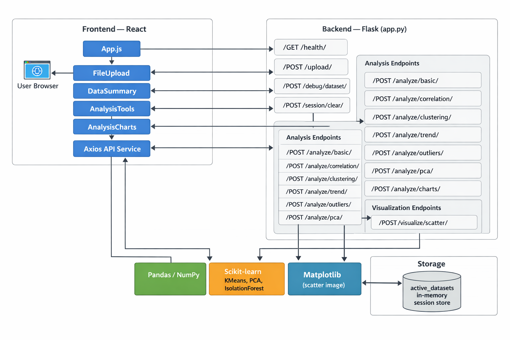
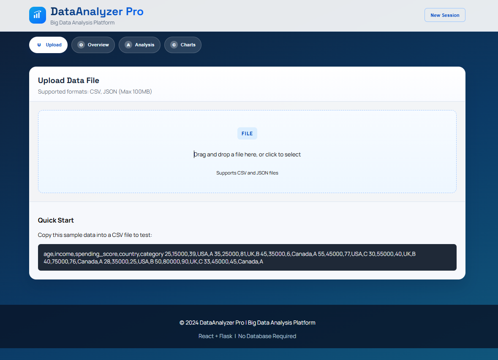
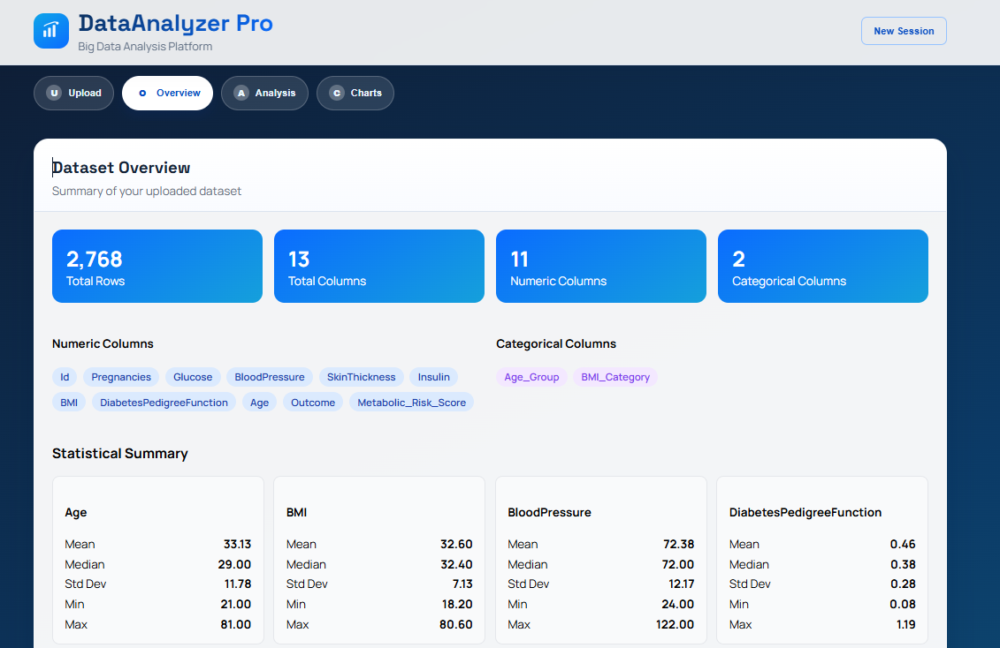
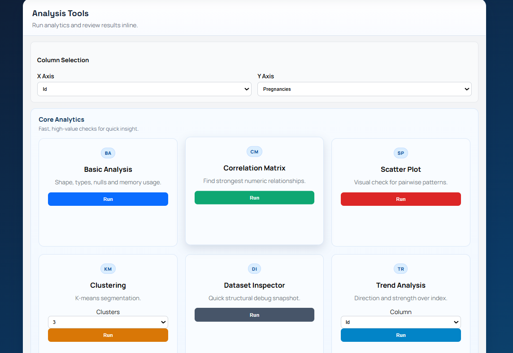
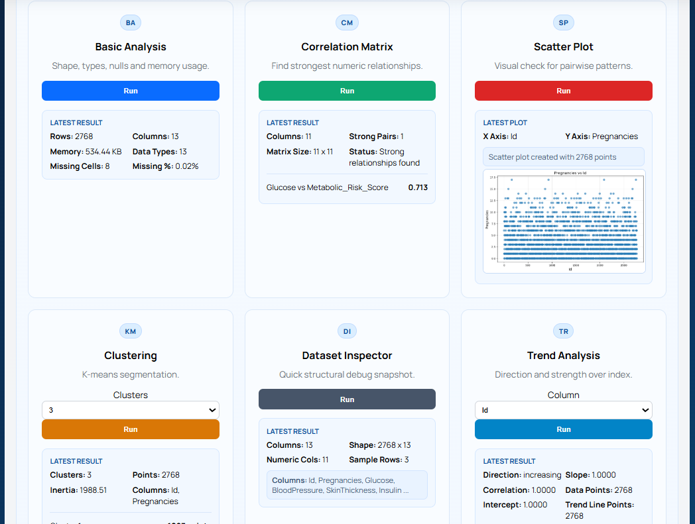
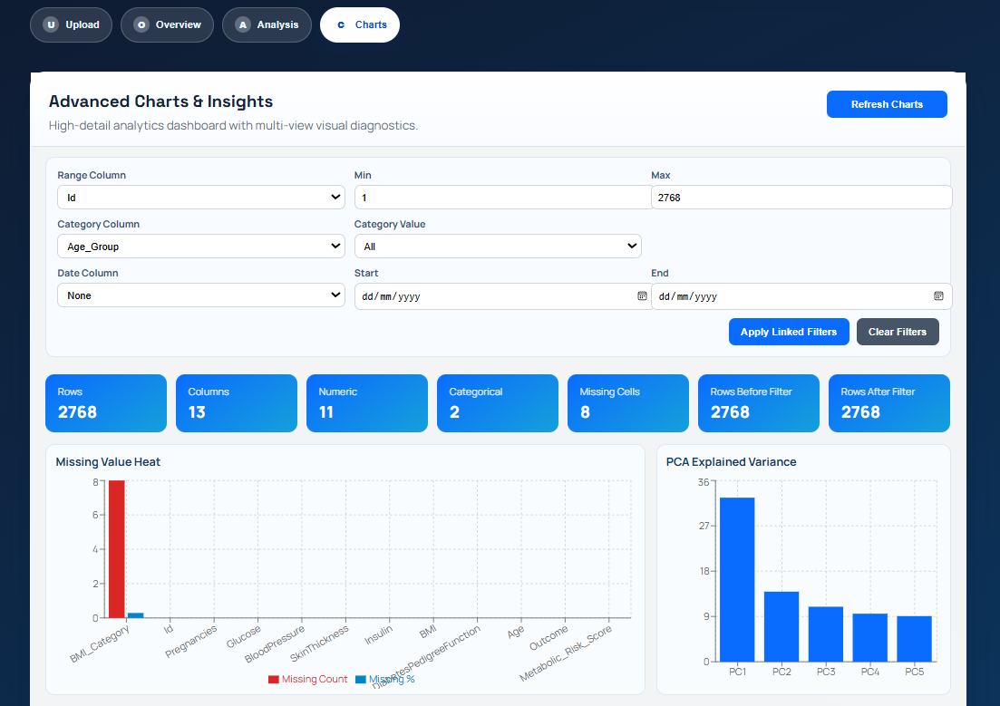
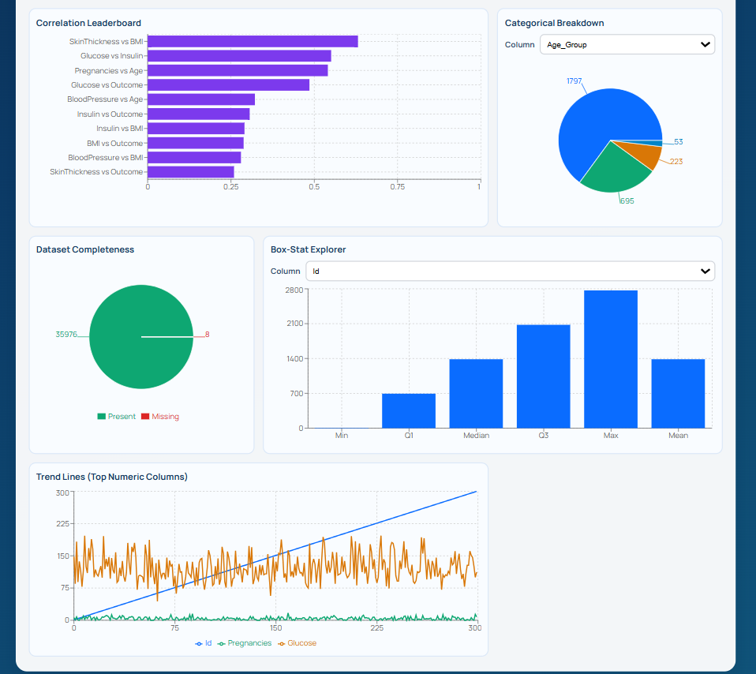

# 📊 DataAnalyzer Pro

Professional big data analysis platform for local CSV and JSON exploration with a React frontend and Flask backend.


## ✨ Overview

DataAnalyzer Pro helps users upload structured datasets, inspect summaries, and run practical analytics workflows from a browser-based dashboard. It is designed for local analysis with support for larger files through disk-backed session handling and sampling-aware processing.

## 🚀 Key Features

- Upload `.csv` and `.json` datasets from the browser
- Handle large dataset sessions with disk-backed storage
- Generate dataset summaries with rows, columns, dtypes, and missing values
- Run core analytics such as correlation, clustering, PCA, trend analysis, and outlier detection
- Explore data visually through charts and scatter plots
- Use sampling-based heavy analysis paths to improve scalability for large files

## 🏗️ Architecture

The project is split into a React client and a Flask API server. The diagrams below show the overall application flow and architecture layout.

### Architecture Diagram 1



### Architecture Diagram 2



## 🛠️ Tech Stack

- Frontend: React, Axios, Recharts, React Dropzone
- Backend: Flask, Flask-CORS, Pandas, NumPy, Scikit-learn, Matplotlib
- Data Processing: Pandas, Dask, PyArrow
- Environment: Python virtual environment, Node.js, npm

## 📁 Project Structure

```text
Bigdata-analysis-app/
|-- backend/
|   |-- app.py
|   |-- data_processor.py
|   |-- requirements_new.txt
|   `-- .env
|-- frontend/
|   |-- public/
|   |-- src/
|   |   |-- components/
|   |   |-- services/
|   |   `-- App.js
|   `-- package.json
|-- sample_data/
|-- screenshots/
|-- Bigdatahero.png
`-- README.md
```

## 🖼️ Screenshots

### Home / Dashboard View



### Dataset Upload and Initial Analysis



### Data Summary and Insights



### Analytical Visualization



### Advanced Analysis Results



### Charts and Exploration View



## ⚙️ Prerequisites

Before running the project, make sure you have:

- Python 3.10 or newer
- Node.js and npm installed
- PowerShell or Command Prompt on Windows

## ▶️ How To Run

### 1. Start the backend

```powershell
cd backend
python -m venv venv
.\venv\Scripts\Activate.ps1
pip install -r requirements_new.txt
python app.py
```

Backend runs at: `http://localhost:5000`

If PowerShell blocks activation, use:

```powershell
Set-ExecutionPolicy -Scope Process Bypass
.\venv\Scripts\Activate.ps1
```

### 2. Start the frontend

Open a second terminal and run:

```powershell
cd frontend
npm install
npm start
```

Frontend runs at: `http://localhost:3000`

## 🔌 Main API Endpoints

- `GET /health`
- `POST /upload`
- `POST /analyze/basic`
- `POST /analyze/correlation`
- `POST /analyze/clustering`
- `POST /visualize/scatter`
- `POST /analyze/trend`
- `POST /analyze/outliers`
- `POST /analyze/pca`
- `POST /analyze/charts`
- `POST /debug/dataset`
- `POST /session/clear`

## 🧭 Usage Flow

1. Start the backend server.
2. Start the frontend application.
3. Open `http://localhost:3000` in your browser.
4. Upload a CSV or JSON dataset.
5. Review the generated summary and insights.
6. Run available analysis tools and explore the chart views.

## 📌 Notes

- Large CSV uploads are stored on disk under backend session folders.
- Heavy analysis paths use bounded sampling for better responsiveness.
- The platform is optimized for local dataset analysis, not distributed cluster execution.
- Frontend API requests are configured to allow long-running uploads and analysis.

## 🧪 Sample Data

The `sample_data/` folder can be used to quickly test uploads and analysis flows without preparing a new dataset from scratch.

## 🛟 Troubleshooting

- If the frontend cannot connect, make sure the backend is already running on port `5000`.
- If you see `Session not found`, upload the dataset again and rerun the analysis.
- If dependencies are missing, reinstall backend packages from `backend/requirements_new.txt` and rerun `npm install` inside `frontend/`.
- If port `3000` or `5000` is already in use, stop the conflicting process and restart the app.

## 👨‍💻 Author

Built as a local big data analysis application for exploring, visualizing, and processing structured datasets through a simple web interface.
